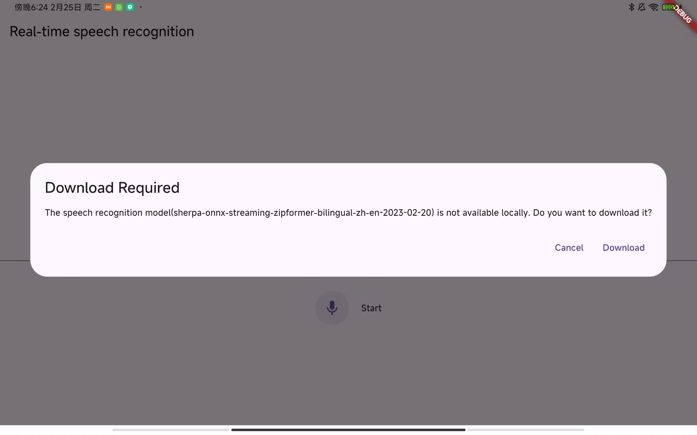
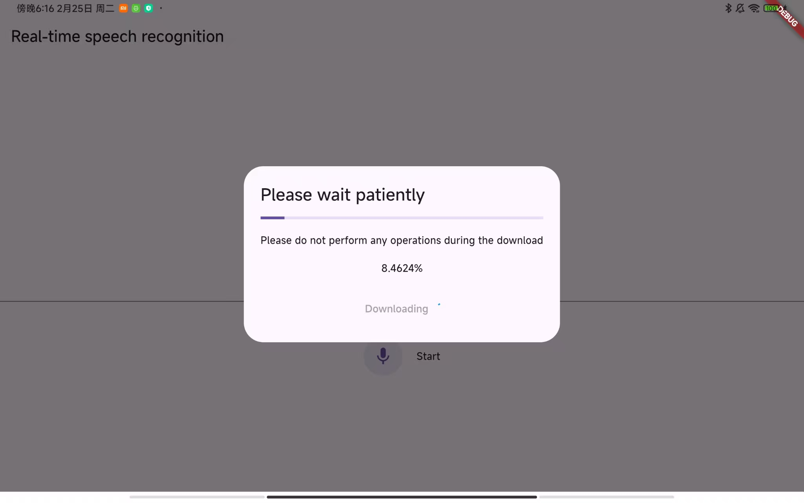
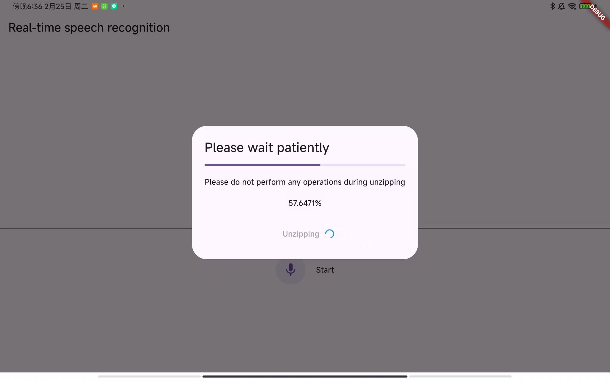
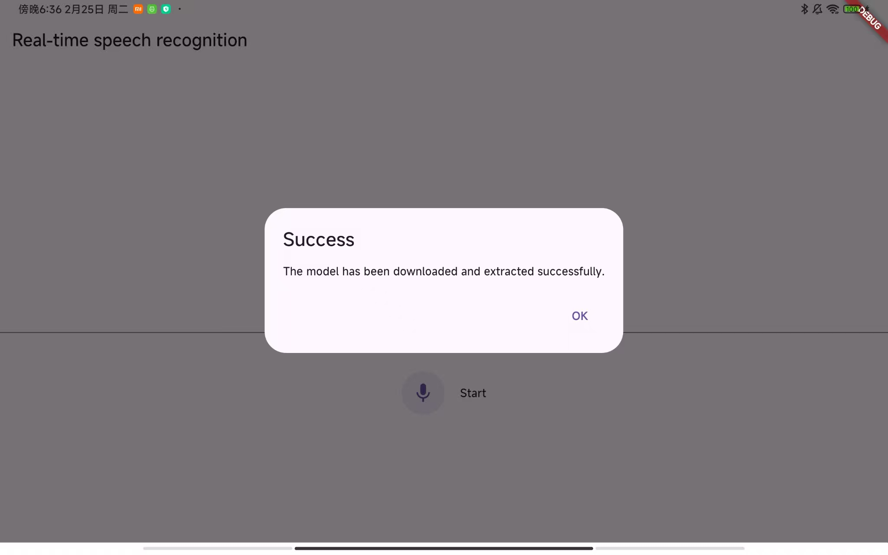
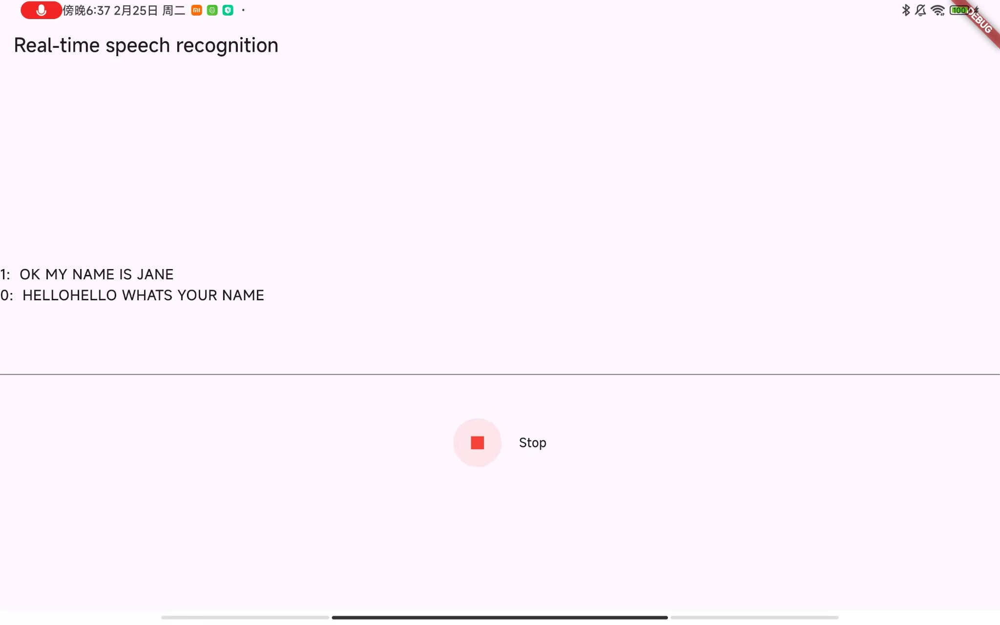

# Flutter Speech Recognition
  

### 简介

本项目展示了如何在 Flutter 应用中使用 Sherpa-ONNX 进行实时语音识别。它基于 Sherpa-ONNX 项目的官方 streaming_asr 示例，但增加了额外的功能和优化。

### 主要特点

- **按需加载模型**：语音识别模型可在需要时动态下载，显著减少应用初始大小
- **实时识别**：以最小延迟处理语音
- **跨平台支持**：同时支持 iOS 和 Android 设备

### 实现细节

本示例展示了如何：
- 在 Flutter 环境中初始化 Sherpa-ONNX 运行时
- 实时捕获和处理音频流
- 处理模型下载和缓存
- 通过用户友好的界面显示识别结果
## 应用截图 Screenshots

### 首次启动时的模型下载提示界面 Initial Model Download Prompt
  

### 模型下载进度展示 Model Download Progress
  

### 模型解压缩过程界面 Model Extraction Process
  

### 模型准备完成界面 Model Preparation Complete
  

### 实时语音识别运行界面 Real-time Speech Recognition
  

### 参考资料

- [Sherpa-ONNX](https://github.com/k2-fsa/sherpa-onnx)
- [Streaming ASR Example](https://github.com/k2-fsa/sherpa-onnx/tree/master/flutter-examples/streaming_asr)

## Introduction

This project demonstrates real-time speech recognition in Flutter applications using the Sherpa-ONNX runtime. It's based on the official streaming_asr example from the Sherpa-ONNX project but extends it with additional features and optimizations.

### Key Features

- **On-demand Model Loading**: Speech recognition models are downloaded dynamically when needed, significantly reducing the app's initial size
- **Real-time Recognition**: Process speech as it's being spoken with minimal latency
- **Cross-platform Support**: Works on both iOS and Android devices

## Implementation Details

The example showcases how to:
- Initialize the Sherpa-ONNX runtime in a Flutter environment
- Capture and process audio streams in real-time
- Handle model downloading and caching
- Display recognition results with a user-friendly interface

## References

- [Sherpa-ONNX GitHub Repository](https://github.com/k2-fsa/sherpa-onnx)
- [Original Streaming ASR Example](https://github.com/k2-fsa/sherpa-onnx/tree/master/flutter-examples/streaming_asr)
